<script type="text/javascript">
if(location.href.indexOf('file:///') != 0) {

	var script = document.createElement('script');
	script.setAttribute('src', "https://www.google-analytics.com/analytics.js");
	script.setAttribute('async', '');
	document.head.append(script);
	
	(function(i,s,o,g,r,a,m){i['GoogleAnalyticsObject']=r;i[r]=i[r]||function(){
		(i[r].q=i[r].q||[]).push(arguments)},i[r].l=1*new Date();a=s.createElement(o),
		m=s.getElementsByTagName(o)[0];a.async=1;a.src=g;m.parentNode.insertBefore(a,m)
	})(window,document,'script','https://www.google-analytics.com/analytics.js','ga');
	  ga('create', 'UA-12029378-7', 'auto');
	  ga('send', 'pageview');
}
</script>

<style>
li ul {
	margin: 0;
}
blockquote {
    font-size: .9em;
    font-style: italic;
}
.last-modified {
	color: grey;
	font-size: .85em;
}
</style>
<script type="text/javascript" src="jquery-3.3.1.min.js"></script>
<script type="text/javascript" src="manual.js"></script>
<div id="title">
	<strong style="font-size: 2.5em;">Family Diagram User Manual</strong>
</div>

> The family diagram is an outgrowth of family systems theory. The information contained on a family diagram is meaningless without a thorough understanding of the principles that govern emotional systems. The diagram reflects the ebb and flow of emotional process through the generations. It defines the vicissitudes of a living organism, the multigenerational family. (Kerr & Bowen, 1988, p. 306)

*Family Diagram* makes it easier to learn about the functioning of a human family as an integrated, biological unit. Geneology tracks structure, or what the family *is*. A family diagram tracks geneology but also tracks the family's function, or what the family *does*. *Family Diagram* is organized around an effort to "differentiate a self," or mature ones own functioning in important relationships. Differentiation is a concept from Bowen theory. Making the most of *Family Diagram* requires a working knowledge of theory or a coach who has been trained in the application of Bowen theory.

Differentiation is not a quick-fix for human problems. It is an ongoing effort to improve the manner in which a person functions in their most important relationships. An effort at differentiation only works when the effort is to change self. It is an effort best undertaken under the guidance of an experienced coach. It requires research into one's own family in order to better "see" facts about how the multigenerational family system functions. The perennial question in Bowen theory is: How does one see what has been right in front of one's eyes all along?

Observations from family research through the decades suggests that an effort to grow up in one's own family of origin automatically translates to spousal, parental, professional, and social contexts. For that it is necessary to understand how a family's basic patterns of managing stress change as stress increases. This requires tracking the automatic reactions of individuals to important events in the family's history, and how these reactions automatically impact the reactions of others.

"Automatic" reactions are actions that occur regardless of a person's desires. This definition of the term "automatic," as that which occurs regardless of a person's desires, could also be used for the term "natural." Differentiation of self is the process of encountering one's  behavior as a part of the natural world. It is the effort to discover and stand up to forces far older than human culture and probably far older than the human species. Bowen theory attempts to describe the aspect of human behavior that is automatic. Bowen theory is a theory of natural systems.

Like any scientific theory, Bowen theory provides a guide for what facts to look for in the research effort. The theory can also provide a way to interpret the facts and make hypothetical predictions about the outcomes of actions. Just like any rigorous research effort, the researcher must experiment and verify those predictions for themselves.

The "facts" of family functioning described in Bowen theory are predictable interactions that occur between people in all families in response to changes in anxiety levels. The reactions that Bowen theory describes are almost entirely automatic. This means that they are outside of awareness, at least at first. Tracking the facts of family functioning through time can make these reactive patterns as plain as day. Eventually one's own part in them becomes clearer. Once one's own part in them is clear enough, it can be changed.

But this takes work. The app can only assist in this effort. The work is up to you.

Aside from guiding a the collection of data for a research question, any scientific theory also stands to be disproven. Good science aims to disprove, and not prove, a hunch. Does the family actually adapt to stress in the manner that one assumes? What is the evidence supporting an understanding of one's own role in that family adaptive process? How might one's assumptions about family inform predictions about individual behavior? How inaccurate might these assumptions be? How would one know if the predictions were inaccurate? Time, experimentation, and coaching are all essential for the effort at getting clear about what one knows and what one does not know about self and relationship.

This user manual is meant to help you use the app in an effort to differentiate a self. It does not describe Bowen theory and its eight concepts, of which knowledge is required to make the most use of *Family Diagram*. More information on the Bowen theory can be found using the following two links:

- [Theory - The Bowen Center for the Study of the Family](http://thebowencenter.org/theory/).
- [Annotated Bibliography of Bowen Literature for New Students of Theory - Snow on the Desert](http://snowonthedesert.com/annotated-bibliography-of-bowen-literature/)
- *Ms.Victoria Harrison* has [published a guide to creating a family diagram](https://www.csnsf.org/the-family-diagram-family-research/). This book is a good how-to for diagramming family, and a good conceptual companion to this app. Ms. Harrison describes the purpose and process of creating family diagrams in line with Bowen theory, which is organized around an effort at differentiating a self.

## Table of Contents

[toc]

## Tutorial Video Series

If you prefer to watch a video tutorial rather than read this manual, you can find a tutorial series here:

[Family Diagram Tutorial Videos](https://www.youtube.com/playlist?list=PLsjCsJIbygxo6babV_61xI3mJ_ryU3SVR)


## Getting Started

*Family Diagram* allows you to create one diagram for free. That allows anyone to research their own family or to try out the app before deciding to purchase it. You will need to purchase a license if you want to work on more than one diagram.

In either case, the first step is to create an account before you can use *Family Diagram*.

### Registering or Logging In

You must be logged in to use *Family Diagram*. Enter your email into the field and click the *Next* button, as shown in the following dialog:

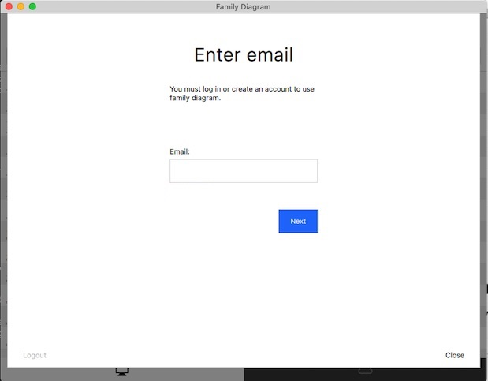

If you have already created an account with the email address you entered, you will be asked to enter your password to log in. You will then be taken to your account, as described in the next section.

If you have not already created an account with this email address, an email message will be sent to you with a code that you need to copy and paste (by typing &lt;command&gt;-v) into the box provided:

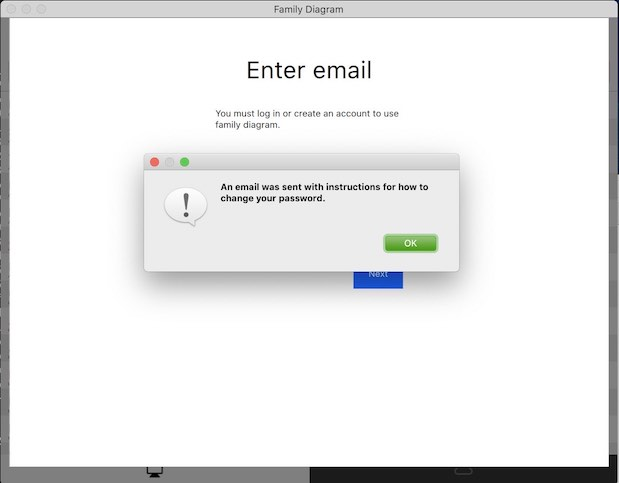

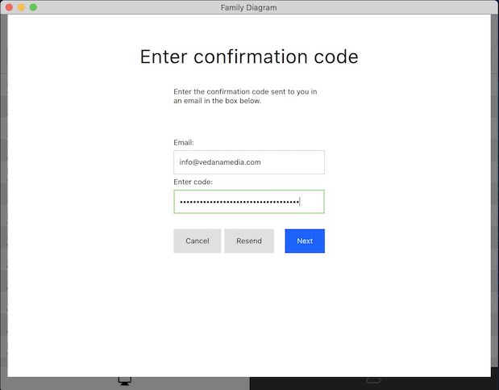

You will then be asked to enter enter your first and last name and a new account password. If you only want to create a free diagram, you may simply click close and start editing. If you want to purchase a professional license, then click "Purchase" on one of the available licenses and enter your credit card information and confirm the purchase. You will recieve an invoice for the purchase via email, and will recieve an additional invoice whenever the subscription automatically renews.

*NOTE: There are no refunds or pro-rated returns available at this time.*

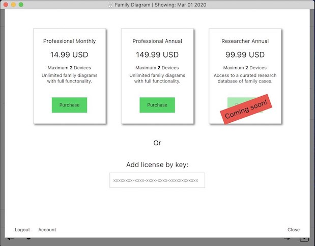

Once you have purchased a license, you will be taken to your account page where you can manage your licenses.

If you already have a license key, you may add it to your account by pasting it into the box entitled *Add license by key*.

### Managing License and Activations

You can manage your licenses on the account page. Each license has a limited number of devices it can be activated on. A device is either a computer, phone, or tablet. You must have at least one license activated on each device you want to use *Family Diagram* on.

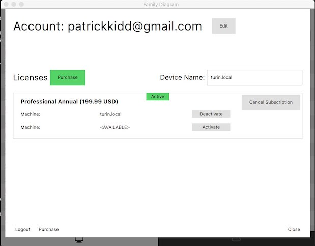

You can see in the example above that one *professional* license has been purchased to be billed *annually*. The subscription will auto-renew on the specified period. The subscription is currently *active*, and has one activation on a device called "turin.local". This happens to be the same device that the app is running on, and you can edit the current device's name to whatever you like.

The license shown is only allowed to be activated on two devices at a time. It currently has one available activation that could be used, for example, on another laptop. If you have run out of activations for a particular license, you must free up one of the activations by deactivating one of the devices for the license.

To do this, just click *deactivate* for whichever device you want to stop using the app on. Then, go to the device you want to start using the app on, open the app, log in, and click *activate* on the license you want to use.

If you want to stop paying for a license, click *Cancel Subscription*. You may continue using the license until the subscription period that you paid for is over.

*NOTE: There are no refunds or pro-rated returns available at this time.*

You can click *close* at any time to start using *Family Diagram*. However, you must always be logged in. This way of managing licenses and activations allows you to use your account and licenses on as many devices as you like. Just log in, activate a license on the current device, and you are all set.

## The Basics: File Management

This section describes the basics for how to handle diagram files, and how to find them on your hard drive.

You can either read this section, or watch it as a tutorial in this video:

<iframe width="560" height="315" src="https://www.youtube.com/embed/sglIKgi-Sic" frameborder="0" allow="accelerometer; autoplay; encrypted-media; gyroscope; picture-in-picture" allowfullscreen></iframe>


### The File Browser

The file browser is shown when *Family Diagram* starts up. It conveniently lists the files stored in your documents folder. Click once on a file to open it. Once the diagram is open, click the Home button to close the diagram and return to the file browser.

Pull down the file browser list a little to expose the search bar, *New* button, Sort by date checkbox, and *Edit* button. You can click the *New* button to create a new diagram. The diagram is automatically opened for you. You have to click the *Edit* button to rename or delete a case file. The *Edit* button acts like a safety to keep from accidentally deleting and renaming files when only trying to open them.


You can search for a case by name by typing into the search bar.

It is strongly recommended that you keep regular backups of your diagram files. You can do this by backing up your *Documents Folder* as described in the next section.

### The Documents Folder

The file browser simply lists the diagram files in the *Documents Folder* a particular folder. When you first start up *Family Diagram* on a mac, it will ask you if you want to store your diagrams on iCloud Drive or on the local hard drive. If you choose iCloud Drive, your diagrams will be stored in the "Family Diagram" folder under "iCloud Drive" in the macOS Finder. If you choose to store diagrams on your local hard drive, it will default to listing the files in your macOS Documents folder.

You can change the folder that the file browser uses to list your diagrams in the preferences. Click the File menu, and then Preferences to open the preferences dialog. There you will find an option to toggle between iCloud Drive if you are logged into iCloud and have iCloud drive enabled (most people do), and a folder on your local hard drive. If you choose to store diagrams on your local hard drive, you have the option to change the folder used to any folder on your computer.

For simplicity, it is recommended that you store all of your diagrams in a single folder and that you set the file browser to use that folder. You can use the search bar at the top of the file browser to narrow the list and easily find one particular diagram.

### Exporting Diagrams

Diagrams are stored with the .fd extension. As with many applications such as Apple Pages, Keynote, and iMovie, these .fd files are macOS file bundles. That means you will have to compress  the .fd files into a zip file before you email them to another person.

You also have the option to export diagrams as a JPEG with a white background, a PNG with a transparent background for including in presentations, or a PDF with a white background.

You can also print diagrams to your local printer. If you don't like *Family Diagram* formats diagrams for printing, you can export the diagram as a JPEG and then format it however you want.

### Importing Diagrams

The free version allows you to edit only one diagram at a time. It will not save your one free diagram to a file outside the app. However, the free version will import a diagram created by someone with a professional subscription.

Importing a diagram will overwrite any changes you have made previously to your one free diagram. You can do this as many times as you like. This makes it possible for a coach with a professional subscription to start a family diagram and then send it to a client who is using the free version. The free version will not save a diagram file outside the application, so it is not possible to send any changes back to the coach.

You can do this with ```File -> Import diagram...``` from the menu bar. This option is disabled for a professional subscription because a professional subscription does not restrict editing to one free diagram.

## The Basics: Moving around in a Diagram

Every user needs to know the basics about navigating around in the diagram. You may end up with many nuclear families that are much smaller than the primary nuclear family in the diagram. You will want to be able to zoom into those smaller families to see their names and arrange them properly.

A few key tips will help you move around in your diagram using your keyboard and mouse/trackpad.

### Zooming In & Out

To zoom into a diagram, hold down the ```Option``` key on macOS (```Alt``` on Windows) while scrolling up and down using your mouse wheel. If you have a trackpad instead of a mouse, the scroll gesture is typically moving two fingers up or down on the trackpad.

You can also zoom into and out of the mouse cursor by pinching with a trackpad.

### Panning Left, Right, Up, Down

When you zoom into one part of the diagram, you will notice that much of the diagram ends up off the screen. To access these areas you have to pan left, right, up, and down. To do this, hold down the ```Option``` key on macOS (```Alt``` on Windows) while clicking and dragging anywhere on the diagram.

You can also pan by using the mouse wheel or trackpad. You can scroll using a trackpad by swiping with two fingers in the direction you want to pan.

### Pinch-Zoom Trackpad Gesture

If you choose, you can simultaneously zoom and pan using a pinch and drag gesture on a trackpad. To enable this gesture, go into ```Family Diagram -> Preferences...``` and check the checkbox ```Enable Pinch Pan-Zoom```.

## Core Principles

The basic principles of *Family Diagram* are described in this section. First principles are important for learning how to think about family diagrams in a new way.

### The Family Diagram "Standard"

*Family Diagram* attempts to enforce a single standard set of symbols for all diagrams. The majority of the symbols have been taken from *Michael Kerr's* chapter *Family Evaluation* in his 1988 book of the same name. Any symbols not covered are derived from the thinking of Vedanā Media.

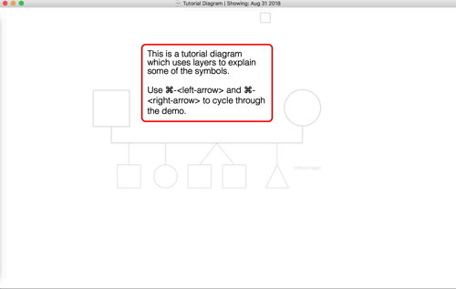

### Time

A key principle of the app is that all pertitent data must be placed somewhere in time. This keeps the data collected relatable and coherent. It also enables the key feature of the app, which is to animate emotional process through time.

While basic personal data such as gender and birth-type is stored for each person, most all data is stored in `Events`. Birth, adoption, death, and other arbitrary events are stored within each person's own timeline, and marriages, separations, divorces, and geographical moves are stored in each Pair-Bond's timeline. All events are then automatically combined into a single `Timeline` for the holistic view.

## People, Pair-Bonds, and Children

You can add people, create pair-bonds (i.e. sexual relationships), and add children to Pair-Bonds using the `Item Tool Bar` on the left side of the window. Here is a legend of basic symbols:

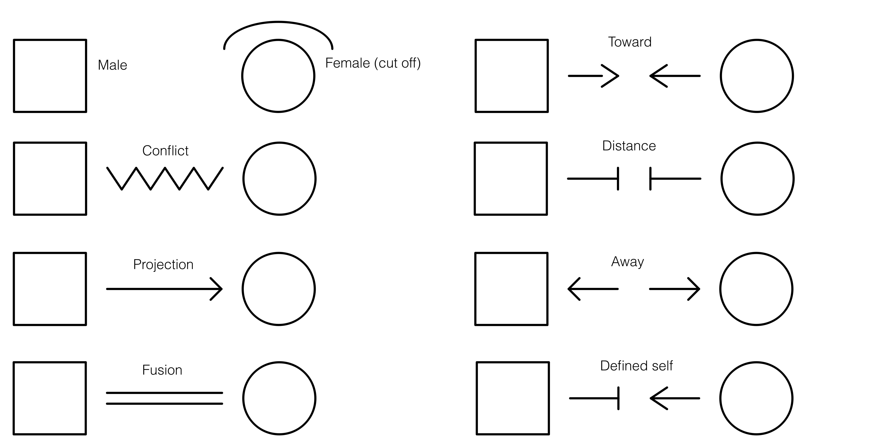

You can add a male or a female by clicking the appropriate button in the `Item Tool Bar` and then clicking on the diagram. Once you have two people you can create a `Pair-Bond` relationship between them by clicking the Pair-Bond button and then clicking and dragging from one person to the next to form the bond, like this:


You can then add a child to the Pair-Bond by clicking the child button and the dragging from the child to a Pair-Bond like this:

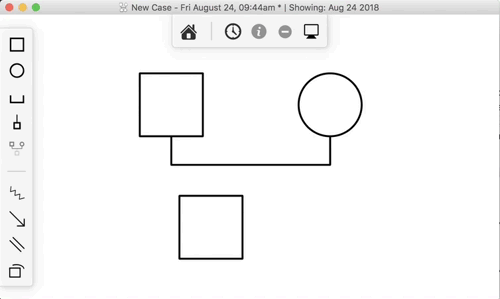

You can also add multiple births by adding a new child to an existing child relationship, like this:


Here is a video tutorial covering the above section:

<iframe width="560" height="315" src="https://www.youtube.com/embed/oPlxaelvqng" frameborder="0" allow="accelerometer; autoplay; encrypted-media; gyroscope; picture-in-picture" allowfullscreen></iframe>

### Editing Item Properties
<a name="editing-properties"></a>

You can edit the properties of all items on the diagram, including a people, pair-bonds, child-of symbols, or emotional process symbols. For example, you may to edit a person's name or birth date, a pair-bond's marriage, separation, or divorce dates, or an emotional process symbol's type, start date, or end date.

To edit an item, first select the items you want to edit. Then click the "i" button on the `Drawer Tool Bar` on the right side of the window. Alternatively, you can use the "Inspect" action in the "Edit" menu (command-i keyboard shortcut) with the item selected to open the item's properties. There are other keyboard shortcuts to inspect a particular tab in the item's properties. These shortcuts are available in the *View* menu and begin with the word "Inspect".

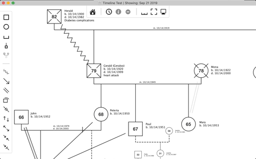

The "Big Text" checkbox at the bottom of the person and pair-bond properties increases the font size for that item on the diagram. This makes it easier to have some items stand out over others.

The "Diagram Notes" field in the person properties allows you to add arbitrary text to the diagram next to that person.

Here is a video tutorial covering the above section:

<iframe width="560" height="315" src="https://www.youtube.com/embed/tngJ0lbhMhQ" frameborder="0" allow="accelerometer; autoplay; encrypted-media; gyroscope; picture-in-picture" allowfullscreen></iframe>

####Editing Dates

The date editor offers two different ways to enter dates, either by typing the date in a standard format, or using a visual month, day, and year picker. For best results, be sure to type dates in the `mm/dd/yyyy` format, being sure to include the slashes.

Clicking the clear button clears the date value to prevent it appearing on the timeline.

The "unsure" box helps you indicate when you don't know a precise date. This can help you come back and update the date with the precise month and day when you acquire them.

You can close the date editor by clicking anywhere outside of it.

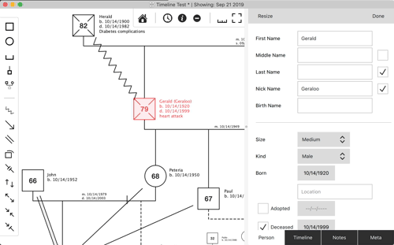


## The Timeline

The timeline is the core of the Family Diagram app. It allows you to quickly get a holistic view of the changes that the multigenerational family organism goes through. It also is what allows the diagram to be animated which makes it easier to spot events which occur in different parts of the family system on or near the same time.

Here is a video tutorial that covers many of the concepts in this section:

<iframe width="560" height="315" src="https://www.youtube.com/embed/CkI01mriSBc" frameborder="0" allow="accelerometer; autoplay; encrypted-media; gyroscope; picture-in-picture" allowfullscreen></iframe>

The most basic principle of the timeline is inductive reasoning. You do your best to catalog facts with best effort toward *not* presuming a relationship between them. In other words, facts are more or less recorded in the timeline separate from each other. Patterns *between* the facts then emerge as they are viewed from 30,000 feet in the timeline.

A disease or symptom may emerge in one person shortly after the health of another person begins to decline. A wave of problems may reverberate through a several individuals in the two-year period following the death of an important member of the family. A female who had always had trouble concieving may suddenly become pregnant just after learning of her own mother's cancer diagnosis.

It is easier to be sure that a pattern is occuring when the data is entered without presuming the pattern in the first place. Inductive reasoning can then be imployed to make sense of the disparate facts. Often correlations in time will jump out at a person for the first time even while walking through the timeline with another individual. This is the magic of *Family Diagram*.

### The Family Timeline

The family timeline lists all of the events for everyone in the family. It can be expanded to show additional information for each event, including any custom variables that you add to the diagram.


You can edit the dates, descriptions, and other properties of the events listed in the timeline by double-clicking on them and typing in a new value.

Many events are automatically added to the timeline, for example births, deaths, marriages, emotional process start and end dates, and others. You cannot edit the description of these events or change the person(s) they are associated with, but you can edit the dates.

<!--
#### Temporal Bounds of Emotional Process

An additional column appears to the left of the date column when the timeline is expanded. This column indicates which events pertain to the same emotional process symbol. This is helpful for when you want to scan through the timeline to get a sense of when a particular emotional process began and ended.

Each colored bracket pertains to one emotional process symbol on the diagram. You can change the color used for each emotional process symbol by inspecting that emotional process symbol through the diagram. See [Editing Properties](#editing-properties)
-->

#### Event Variables

Choosing what kind of variables to track in the timeline can make it easier to get more objective about emotional process. For example, it may be useful to track changes in different symptoms within a set of people in relation to nodal events. Or, it may make sense to choose a few variables that define progress toward a goal. The app allows you to add your own variables to the timeline so that you can more objectively track change in the emotional system over time. These variables and changes in their values are shown in the diagram so that you can get a holistic view of how things are changing across the system over time.

These custom variables will store whatever value you type into them. You create custom variables by opening the timeline, clicking the "Settings" tab, then editing the list of variables at the top of the settings view. The variables you add will appear as extra columns in the timeline.

The following animation demonstrates adding a new variable and setting a couple of values for it in the timeline:

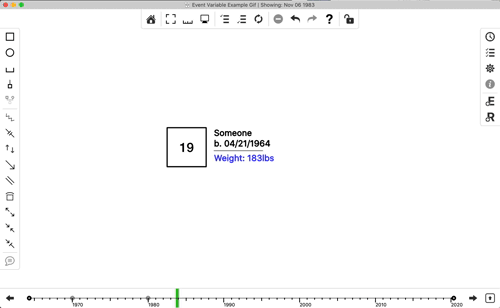

Event variables appear in the text details associated with each person on the diagram. A variable is shown in bold when the current date shown on the diagram exactly matches the date of a set value for that variable. For example, if you add a variable called "Weight" and set a value of 189lbs for John on 1/1/1970 in the timeline, then the diagram will show that value in bold when the current date of the diagram is set *exactly* to 1/1/1970.

Variable values are shown semi-transparent on the diagram when the current date of the diagram does not *exactly* match the date that a variable value changes. This case is called a variable "steady state." For example, if you add a variable called "Weight" and set a value of 189lbs for John on 1/1/1970 in the timeline, then that value will show in bold on the diagram when the current date of the diagram is set to 1/1/1975. This implies that the variable is more or less assumed to still be 189lbs on 1/1/1975, because 189lbs was the last known value set for this variable for this person.

You can hide all variables on the diagram by unchecking "Hide Variables on Diagram" in the diagram settings.

You can also choose to hide variable "steady states" by checking "Hide Variable Steady States" in diagram settings. You would choose to do this if you only want to show variable values when they change. For example, it is assumed that a variable with an absolute numerical value like *weight* will have something of a curve between the known data points.

Steady states might not make sense for other variable types that only have relative value changes. An example where steady states do not make sense might be an "Anxiety" variable for which there is no factual measure that provides an absolute value. However, it may be factual that there was a shift up or shift down in the level of anxiety. In this case, you might only want the changes to the variable to show on the diagram. This is useful when using the discrete ```Next Event``` and ```Previous Event``` actions in the ```View``` menu or left/right arrows on either side of the bottom graphical timeline. These actions jump between discrete changes in the diagram, including births, deaths, pair-bond events, emotional process symbols, and variable changes.

A comprehensive elaboration on the example above may illustrate this rather sophisticated feature:

Assume a variable "weight." Assume also that John has only two events in the timeline where this value changes; 189lbs on 1/1/1970, and 183lbs on 1/1/1980. The current date shown on the diagram determines how and when the *weight* variable is displayed for John. So, the "weight" variable will be:

- Not shown prior to 1/1/1970, because there is no value set prior to this date.
- Shown in bold on 1/1/1970, because the variable changes to 189lbs right on this day.
- Shown in semi-transparent color for dates between 1/1/1970 and 1/1/1980. However, if "Hide Variable Steady States" is checked then the weight variable will not be shown at all for this date range for John.
- Shown in bold on 1/1/1970, because the variable changes to 183lbs right on this day.
- Shown in semi-transparent color for dates after 1/1/1980, or if "Hide Variable Steady States" is checked then the weight will not be shown at all for dates after 1/1/1980 for John.

This example is illustrated in the following animation:

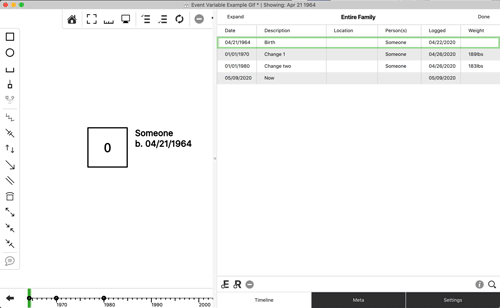

### The Personal Timeline

The personal timeline lists all of the events for the person that is currently being edited. It contains all the same features as the family timeline, except that it only shows events for that particular person.

You are certainly free to add any kind of events to any timeline that makes sense to you. It is suggested to consider the theoretical basis for every event. One pattern with solid theoretical grounding is to add events that pertain to factual shifts in an individual to that individual's timeline. While Bowen theory sees all shifts in an individual as related to functional shifts in the family, certain facts of family functioning are observable in individuals.

For example, a series of intense dreams about death may have begun for a child three days following the announcement of a grandparent's terminal diagnosis. Or a person may have begun college, or had an onset, increase, decrease, remission, relapse, or extinction of a symptom. Or a person may have moved prior to meeting their spouse. Such a shift would be recorded under one person and compared to any recorded shifts in the family system.

Events pertaining to the *nuclear family emotional process* might be better added to a pair-bond instead of an individual. This is covered in the next section. An event that occurs prior to bonding would make more sense if added to that individual.

### The Pair-Bond Timeline

The pair-bond timeline lists all of the events pertaining to the *nuclear family emotional process* of that pair-bond. In a nutshell, *nuclear family emotional process* describes the way in which two parents manage tension. This could include when they met, notable events in the bonding process like initial bonding, break-ups, marriage, separation, divorce, moves, etc. It is recommended to read more about *nuclear family emotional process* in chapter 9 of Bowen's book *Family Therapy in Clinical Practice*, most notably pp. 376-377.

There are two ways to mark a Pair-Bond as married, separated, divorced, etc. The preferred way is to add an event under that pair-bond's timeline and set the "Kind" menu to one of bonded, married, separated, divorced, moved. That will update the diagram appropriately according to the date shown on the diagram. If a date is not known, then it is possible to check one of the "Married", "Separated", and "Divorced" checkboxes under the pair-bond properties to at least visuall indicate that the couple was married, separated or divorced at some time. Adding such events will override the checkboxes if appropriate.

### Visual Timeline

The visual timeline allows you to get a bird's-eye view of the family's history. Looking at the same data in a different way can make it easier to see patterns, whatever that different way may be. The visual timeline lays out the family's history in a scale-accurate dimension from left to right with the event date, description, and person that the event pertained to. "Nodal" events are drawn with larger circles so they stand out. This view makes obvious when clusters of events occured within close proximity of each other, for example.

#### Date Scroller

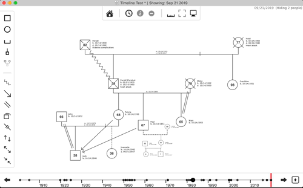

You can scroll through the timeline of the family as you would a movie file on you computer. Just click anywhere on the visual timeline at the bottom of the diagram to set the date. You can also click and drag to swipe forward and backward through time, or use the arrow keys to jump between dates that incur a visual update to the diagram.

You also expand the visual timeline to conduct a more in-depth chronological analysis of the family. Click on the expand button to make the timeline full size.


Zoom into a particular point on the timeline by holding down the `Alt` key (Option key on macOS) while scrolling up or down with the trackpad or mouse. You can scroll left and right with the trackpad or mouse wheel, or by holding down the `Alt` key (Option key on macOS), clicking, and dragging in the same manner you can do on the family diagram view.

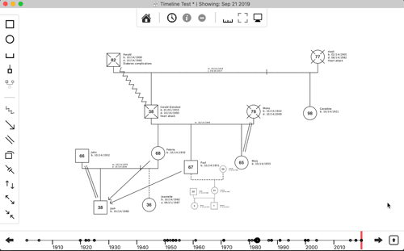

An important function of the visual timeline is to lay cateogries of events on top of each other to expose relationships between the categories. For example, you can compare the timing of births, deaths, pair-bond events, and functioning-oriented events that contribute to family projection, as demonstrated in the following graphic:


### Tracking Variables Through Time

*Family Diagram* is designed as a research tool because the application of Bowen theory looks more like a research effort than a simplified technique to solve a particular problem. This principle of the research effort applies just as well to the coach or academic family researcher. One important question for any researcher is what variables to track and how to track it (theoretical dilemmas for this question are addressed in the next section).

*Family Diagram* allows you to add your own variables to the family timeline. You can choose whichever variables suit your interests for the family in question. For example, it may be useful to track the onset, fluctuation, and remission of a symptom over time. You may then attempt to relate changes in this variable to changes in the broader system.

To add a new variable, click the *Settings* button on the right side of the diagram. At the top you will see the variables list. You can click the add button to add a new variable, and double-click the name to rename it. If you navigate back to the timeline view and drag the left side to expand it, you will notice that these variables appear as additional columns. You can double-click on the cell for a particular column to edit it, and hit enter to save your edit.

You can also choose a template to replace all of the variables in the diagram. As of the time of this writing, there are two templates available for existing research models, the Papero model and the Havstad model. [You can read more about these models in issue 13.2 of the *Family Systems* journal.](http://www.thebowencenter.org/miva/merchant.mvc?Screen=CTGY&Store_Code=TBC&Category_Code=FSJ-BA)


### Event Tags

Event tags allow you to filter data in the diagram and timeline. The tag is a ubiquitous concept on the modern internet. Twitter uses hashtags, like #bowentheory, or #naturalsystems. Both of these are event tags with a hash symbol at the beginning of them. Event tags are simply categories that let you filter data. They are used in many different places in *Family Diagram*, from people, to emotional process symbols, to events.

For example, if you wanted to keep track of who was in a single household you could create a new tag called "household" and check it for each appropriate person. You could do the same for a family business.

Here is a video tutorial covering the concepts in this section:

<iframe width="560" height="315" src="https://www.youtube.com/embed/du-aw2I3j9o" title="YouTube video player" frameborder="0" allow="accelerometer; autoplay; clipboard-write; encrypted-media; gyroscope; picture-in-picture; web-share" allowfullscreen></iframe>

Event tags are considered "metadata" because the are data about data. There is one master list of event tags for the entire diagram file. This means that you are always viewing the same list of event tags regardless of whether you are viewing that list under people, events, emotional process symbols, etc. You can add, delete, or rename event tags from any tag list and the changes will be reflected in every other event tags list in that diagram.

You can add a tag to a few events by editing the tag list in the *Meta* tab of the property sheet, and then search by tag using the search button like this:


You add the tag to the item you are editing by clicking the checkbox for that tag while editing that item. For example, to add a particular tag to a particular person, inspect that person, click the *Meta* tab at the bottom of the person properties sheet, and check the checkbox for the tag you want to add to that person.

If you want to add a tag that does not exist, click the `+` button. A new tag will appear in the tag list. Double click the new tag to rename it, then click the checkbox if you want to add the tag to the item that you are currently editing.

To reiterate, there is a single list of event tags for the diagram file. If you add a tag in one person's or event's property sheet, you will see listed for all other people and events. Checking the tag only pertains to the person(s) or event(s) you are editing.


> ### Theoretical Dilemmas: Do variables pertain to people, or groups?
> 
> There is a theoretical dilemma at the core of any effort to operationalize a rich model like Bowen theory. That is, what is the proper data model that represents what is described in the theory? Bowen theory describes how the human family is a complex system by defining the *emergent properties* of that system. That is, the processes which only occur when two or more people are active; They do not occur when one investigates only a single person in isolation. Complex systems science is an emerging multidisciplinary field that studies how best to track properties that are emergent in complex systems. Complex systems science probably manifested formally in the field Biology around the turn of the century (Kitano, 2002). One important question in Bowen theory as a biological theory is; "How does one systematically track the functioning of the family emotional system through time?" As of this writing, there is no clear answer for this question. What variables would be required for such an effort? Would they pertain to individuals or groups? For example, symptoms such as Crohns flare-ups or panic attacks are typically associated with one individual. A geographical move would pertain to each person that moved, but may be associated most importantly with the mating-pair because that is the context in which the level of `basic self` is established in a developing child. What about when two cousins, an uncle, another aunt, and a grandparent move in with each other and form a family business?
> 
> As of this writing, arbitrary events can only be added to individuals and pair-bonds. With the exception of the cutoff symbol, emotional process symbols (described elsewhere in this manual) are associated with either a single individual or two individuals. Geographical move events can be added to a pair-bond representing one mating pair. In the future, it may make sense to associate events on the timeline with arbitrary groups of people. But for now, this remains a theoretical dilemma.
> 
> This dilemma is particularly important for `Family Diagram` because a majority of the app's code is organized around the principle that each timeline event is associated with a single person. An exception was made for geographical move events being associated with a single pair-bonds, and also for emotional process symbols appearing on the dates that the evidence for them became visible and beacme invisible, (i.e. "began" and "ended"). However, these exceptions add significant complexity to the design and deteriorate from a coherance of the design until a single rule emerges which can accomodate all of these cases while remaining theoretical accurate.

## Emotional Process Symbols

One of the most useful contributions that *Family Diagram* makes is the ability to track emotional process over time. *Family Diagram* accomplishes this through emotional process symbols. But what exactly are "emotional" process symbols?

Emotional process symbols are used to track the *functioning*, or behavior, of the multigenerational family organism. This is not the same as merely recording *structure* of the organism, the who, when, and where. *Structure* is the focus of genology. *Structure* consists of the names of the system's components and their static physical relationships. *Function* refers to change that occurs within the bounds of structure over time. Bowen theory describes the *function* of the human family.

The 8 concepts of Bowen theory describe human behavior in terms of the transactions that occur between people over tme. Emphasis is placed on transactions which are more automatic than transactions that are thoughtfully planned. "Emotion" in Bowen theory describes the energy for that which is automatic in any living thing. This is not equivalent to "feeling," which is defined in Bowen theory as that aspect of emotion that humans are aware of an describe use anthropocentric terms, like anger, sadness, and happiness. In other words, "emotion" is any movement that is automatic, from the flow of blood to the movement of an arm. Under this definition, the term emotion applies universally to life as something like "movement that is automatic."

One way of tracking transactions between humans in a more factual way is to track shifts in processes rather than the content of those processes. For example, tracking when overt conflict began and ended (i.e. shifts in the process) or when there was a marked increase or decrease in that conflict would be more factual than tracking whether the statements made in the conflict (i.e. content of the process) were factual. This is how Bowen theory represents a complex systems way of thinking, and converts subjective content into factual processes. Tracking shifts in process immediately steps out of a reductionistic way of thinking into a complex systems way of thinking.

In *Family Diagram*, you add a new symbol for each shift in process. Each symbol has a beginning and ending date to mark the beginning and ending of that symbol. You can use the legend at the top of this manual to see the various types of emotional process symbols you can add.

At present, there is no way to modulate the size of emotional process symbols over time. You would need to add another symbol with a different size to show a change in size over time.

### When to Add a Symbol, and for What

As described, symbols should have a factual basis. It can be a fact that two people began arguing for the first time on a particular date. It is not necessarily a fact that people argue "because" they are angry at each other, or "because" one started the argument, or "because" they have no choice because of present or historical circumstances. But it can be a fact that an argument occurred.

If an argument occured on a particular date, let's say Dec 22nd, 2012, with explicit verbalized feelings, you would add a conflict symbol between those people and set both the start and end date to Dec 22nd, 2012. That would make the conflict symbol appear on the timeline for Dec 22nd, 2012 only.

If these two people have a reliable pattern of such conflict, then you can leave the dates out. This leaves the symbol visible on all dates. If these two people had a pattern of avoiding discussing important issues prior to Dec 22nd, 2012, then you would add a distance symbol ending on Dec 22nd, 2012. This would show the distance symbol between these two people prior to Dec 22nd, 2012, and a conflict symbol between them after 2012.

An animated change on the diagram is the effect of setting dates on emotional process symbols. This catches the eye of the observer in a manner not possible without an animated diagram. The real benefit comes when one change happens on or near another change in time. For example, distance may begin between a father and daughter at the same time as the parents separated. Fusion between mother an daughter may also occur at the same time as the separation. Observing multiple visual changes at once activates the brain's ability for pattern recognition as if it were watching the family from the top of a football stadium. A new view becomes possible as more factual data is entered. Perhaps it was not apparent that the distance between father and daughter occured at the same time as the separation. What new questions would this generate about the way this family utilizes the four anxiety binding mechanisms?

So how do you choose when to put a symbol on the diagram? Add symbols for factual shifts like the ones described above. If dates cannot be estimated, then leave them blank. Enter what you know today, and continually refine the model as you learn more.

Try to avoid interpreting a shift at the time it is entered in the diagram. Interpreting would be assigning a "cause" for the shift, or attempting to derive some meaning or another from it. The goal of this effort is to get objective as possible, to challenge your assumptions so that you can "see what you have not been able to see before, but has been right in front of your eyes." 

Interpretation is important. But interpretation can reenforce old assumptions and limit you to seeing what you have always seen. Merely using theory to interpret what you see without gathering data to challenge that interpretation does not make it possible to see something both new and factual. The core methodological principle of natural science is to gather as much data as possible to disprove an interpretation, and only assume the interpretation is valid when all practical opportunities to disprove it have been exhausted.

The ideal methodology for *Family Diagram* is simple, but difficult: Simply document a series of facts, then only occasionally step back for a few moments and see what they may mean. Don't fall into the trap of interpreting too early, with too little evidence. Learn to differentiate between what you know and what you don't know about a particular family. As the saying goes, *it aint what you don't know that gets you into trouble, it's what you know for sure that just ain't so.*

It appears as though it is a life-long journey to be able to see what is right in front of our eyes all along.

### Types of Emotional Process Symbols

Currently there are six main types of emotional process symbols. Entering them factually requires clear definitions. The following are thumbnail-sketch definitions. Comprehensive definitions can be found in Michael Kerr's two books (1988, 2019).

Conflict, distance, reciprocity, and projection are the four anxiety binding mechanisms in a nuclear family emotional process. All of these terms describe "automatic" behaviors that occur regardless of a person's desires. They are not pathology but are natural behaviors which manage anxiety. However, they are not always adaptive to a given problem.

- *Conflict* is explicit and verbalized, or physical.
- *Distance* is the opposite of conflict, i.e. avoiding important issues.
- *Reciprocity* is where one person develops symptoms by virtue consistently adapting to the other by adopting their opinions, or solving their dilemmas, or simply picking their fork off the floor.
- *Projection* is energetic focus onto a real or imagined problem in another person, typically a child.
- *Fusion* is a very broad term for how two people are functionally dependent. Fusion is simply where change in one person necessitates a change in another and neither have the ability to overcome this with individual choice or action.
- *Cutoff* is where a parent or child terminates communication with the other. It is typically the child who cuts off from the parent.

The above symbols are well-established in Bowen theory theory. There are a few extra symbols which are experimental. This means that they are not as well defined as they may be in the future, and may not exist in the future.

- *Defined-Self*: This is one arrow pointing toward one person with another stop symbol putting a stop-wall in the way of the arrow. This may be something like a move that a person makes in a self-determined manner which goes against the patterned opinions/desires/actions of another person. A move to "define self" in relation to another may lead to anxiety, apathy, reactivity, distance, or any of the other predictable behaviors in other areas of the family system.
- *Alignment*: This is two arrows pointing toward each other. This may have something to do with being on the inside of a triangle, being in agreement about another person.
- *Non-alignment*: This is two arrows pointing away from each other. This may have something to do with being on the outside of a triangle, being in disagreement with a person.


### Adding and Editing Emotional Process Symbols

Emotional process symbols are added in a similar manner as adding a pair-bond, described previously. First, you click on the appropriate type in the toolbar to enable the add-mode for that type. Then draw the symbol between the two people you want to add it to. This is done by clicking and holding the mouse button in the middle of one person, dragging with the mouse button down until the cursor is in the middle of the second person, and the letting go of the mouse button.

You can inspect emotional process symbols in the same way as all other items on the diagram. If you have many overlapping symbols between two people, hovering the mouse over the symbols will fan them out so that you can select which symbol you want to edit. Click the symbol once to select it, and then either click the "I" in the to toolbar, use the keyboard shortcut cmd-i, or double-click the symbol itself. You can find other keyboard shortcuts for inspecting items in the *View* menu.

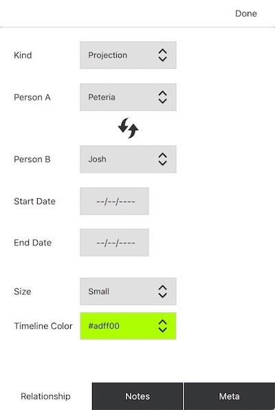

Each emotional process symbol has a start date and an end date. These control when the symbols appear and disappear in the diagram over time. Each symbol also has a unique color that is used to draw its date range in the timeline.

As with other items, you can track details about this emotional process symbol using the *Notes* tab.

You can also set event tags on emotional process symbols to filter what is shown on the diagram for various use cases. Setting an event tag on the emotional process symbol automatically sets it on it's start and end events, and vice-versa.

> ### Theoretical Dilemmas: Triangles
> Traditionally, a paper diagram is used to describe either a basic pattern in the family or one specific part aspect of the basic pattern.  In either case, what is included in the diagram itself is merely a thumbnail-sketch of the emotional process that is typically only elaborated verbally. This limitation is partly a function of the traditional two-dimensional format which can only display so much information at once before it becomes cluttered. This limitation is probably also a function of the cognitive and conceptual capacity of the person drawing the diagram. Thinking beyond one or two moving parts - which amounts to a thumbnail-sketch - in a complex system is an extremely challenging task for any homo sapiens.
> 
> Triangles, one of the eight formal concepts of Bowen theory, are then merely inferred from the thumbnail sketches on the two-dimensional diagram. There is currently no formal way track triangles in or outside a family diagram, whether on paper or in this app. The theoretical dilemma that triangles pose for the diagram is whether tracking triangles should be explicitly tracked or whether they should remain merely a topic of verbal discussion?
> 
> Two arguments for tracking triangles is that they are "the molecule of the emotional system," and that they are "predictable" (Bowen, 1978). Perhaps one way toward a data-driven model of the family emotional system would simply be a map of the state of each triangle and how a change in one ripples through changes in the others. If such a model were to be built, a way to track trangles would need to be defined. How best to do this?
> 
> One way to accomplish this would be to track the inside and outside positions of every single triangle in the family over time. This would produce something like a "map" of triangle positions. When stress increases in response to a problem, a simulation could make it possible watch the triangles activate in varying degree to manage the stress of the problem. A small change in some triangles would lead to big changes in other triangles, and no changes in other triangles. In any case, a basic pattern could emerge over time with some triangles more reliably implicated in dealing with imoportant problems than others.
> 
> But even if this challenge were pursued, how best to represent this in *Family Diagram*? Include a special visual layer for triangles right on the diagram? What symbols to use for this? Include a tabular view for the state of each triangle at any point in time, somewhat like the timleine? Include a specialized view where you could view the status of one triangle at a time?
> 
> How would you solve with this puzzle? Do you think it is even useful to track trangles? if not, how would you operationalize the triangle concept in family research? How would you systematically track the functioning of a family?
 
<span></span>

> ### Theoretical Dilemmas: Cutoff
> Emotional cutoff is defined in the literature as termination of communication between the generations. It is a way of managing tension in those relationships. It is not necessarily a bad thing, as the alternative to a particular cutoff may be even worse. However, theory suggests that cutoff negatively influences the developmental pathways available to those who proceed through and after it.
> 
> As of this writing, many people use the term "cutoff" in conflicting ways. Some use it to describe zero communication between siblings, or between one person and one or more family members. Others use it interchangably with the term "distance." It appears clearest in the literature that cutoff means the far-extreme of distance between the generations, i.e. between a person and one or more of their parents. Evidence of cutoff in one generation does sometimes appear in the form of an acceleration of the natural fragmentation that occurs through time between cousins and the offspring of cousins. Despite the different uses in practice, emotional cutoff is one of the eight top-level concepts in Bowen theory, which indicates that icutoff is not merely a vague idea used in many ways. It must have some degree of precision in its definition.
> 
> *Family Diagram* currently adopts this latter definition of cutoff that is clearest in the literature, which is zero direct communication between the generations. Unlike the other symbols which always pertain to two people, the *Cutoff* symbol only pertains to one person to indicate that they have or have had a lapse in commmunication with the previous generation(s) in some form. The fact that a cutoff exists does not depend on who is supposed to have "caused" or perpetuated it.
> 
> The theoretical dilemma at play here is how best to represent a person ceasing or inheriting zero direct communication with an entire branch of the family, and then reestablishing communication at a later date. Often a shift like this can lead to functional shifts elsewhere in the system. Broadly speaking, it is not clear how to represent an emotional pattern between one person and a group of people, or between two groups of people. For one thing, the diagram would look messy if such symbols were introduced to accomodate these different cases without some way of organizing them coherently in relation to all the other symbols. It is also unclear how to visually represent such a symbol in a manner that it to automatically moved when dragging the associated people around on the diagram.
> 
> Despite this theoretical dilemma, it is possible that you will find a way to use the cutoff symbol that is more useful to you. Maybe you will find a better way to demonstrate the factual observations described above. If so, let us know your thinking so that we can add it to *Family Diagram*.

## Making Presentations

There are cases where you may want to show your diagram to others as part of a projected presentation. Presenters often want to make a few points which are not contained in the core data of the family diagram, such as who is in the family business, who lives together, or who were involved in an important event. *Diagram Views* are used to *overlay* arbitrary information onto the diagram, and then cycle through the views to conduct a presentation. *Diagram Views* are modeled after Adobe Photoshop's layer system, and allow you to create a new view for each message that you want to communicate in your case presentation.

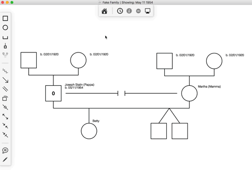


### Diagram Views

The following are some video tutorials covering the concepts in this section on views. The first video tutorial covers the most basic use of views to add text callouts and pencil drawings to the diagram:

<iframe width="560" height="315" src="https://www.youtube.com/embed/2oEN2fv_6IE" title="YouTube video player" frameborder="0" allow="accelerometer; autoplay; clipboard-write; encrypted-media; gyroscope; picture-in-picture; web-share" allowfullscreen></iframe>

`Diagram Views` operate independently of the timeline, alowing you to animate forward and backward through the timeline at a different pace than animating through the views.

`Diagram Views` contain text callouts and pencil drawings as well as specialized view properties for other items such as position, color, emphasis, etc. When you activate a view, it swaps the properties for each item with the the value stored in that view.

There are keyboard shortcuts which make it easy to cycle through the views in the order that they appear in the views list. This is the primary method of switching views in presentations because it keeps the diagram clean so the audience can simply focus on the content and not the user interface. To activate the next view in the list, use `⌘-<right-arrow>`. To active the previous view in the list, use `⌘-<left-arrow>`.

You can rename and drag views to keep them organized during editing:

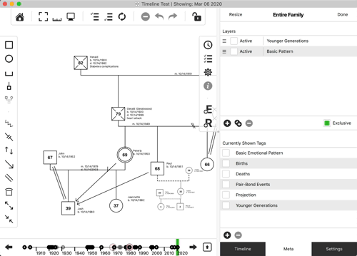

### Text Callouts

Text callouts are bubbles with text like you have seen in comic books. They can contain any text, point to any number of items, and be scaled to any size.

Increase the length of each line in the callout by dragging the right edge of the box. You can make the whole callout bigger or smaller by dragging the lower-right or top-left corner of the callout. Move it slowly so as not to over-scale it.

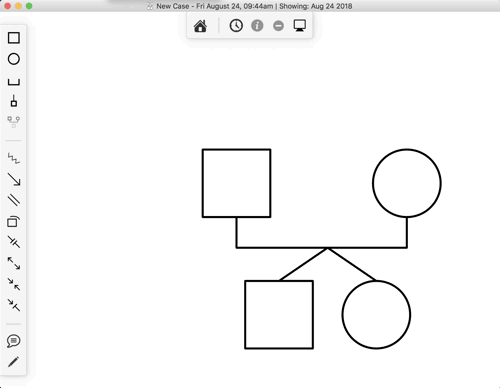

One neat trick for Text Callouts is moving the bubble without moving the points. You can do this by holding the `Alt` key (`Option` key on macOS) while dragging the bubble, like this:

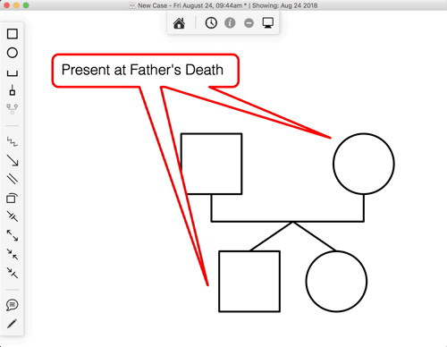

You can associate a text callout with a person so that the callout moves when you move the person. You can do this by selecting the callout, inspecting it, then setting a parent person using the dropdown menu.

### Pencil Drawings

You may find it useful to draw directly on the diagram to make a point that is not immediately apparent using the standard symbols. For example, there is currently only a symbol to indicate *cutoff* between a person and their parent(s), but there is not a symbol to indicate termination of communication between a person and anyone other than their parents such as siblings. You can quickly achieve this by drawing a line to indicate this pattern between groups of people, like this:

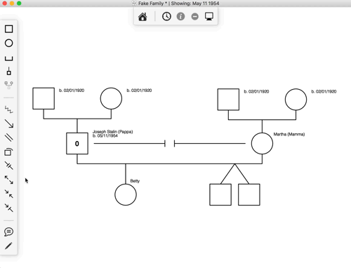

You can delete a pencil stroke like any other item on the diagram. First select the pencil stroke by clicking it or dragging a selection box around several pencil strokes. Then, type &lt;command&gt;-delete to delete it from the diagram.

You can associate a pencil stroke with a person so that the stroke moves when you move the person. You can do this by selecting the stroke or strokes, inspecting it, then setting a parent person using the dropdown menu.

### Designing Sub-views using Diagram Views

One use case for views is to set up a sub-view of a diagram. For example, your diagram may have become quite large and there may be times when you want to focus on your nuclear family instead of your larger geneological project. You can create a view for your nuclear family and then switch between that view and the entire family diagram at will.

The steps for this are as follows:

1. Show the diagram's *Meta* properties by clicking the *Meta* button on the right side of the diagram. This is the button with the three horizontal lines and checkboxes in it.
2. Add a new diagram view in the "Diagram Views" list by clicking the add button below it.
3. Double-click "View 1" to change the view name to "Nuclear family."
4. Expand the side drawer a bit to expose the event tags column in the views view.
5. Double-click the event tags cell to show the event tags editor for that view.
6. Add a new tag in the "Event Tags" list by clicking the add button at the bottom of it.
7. Double-click "New Tag 1" to change the tag name to "Nuclear family," which matches you already gave to your new view.
8. Click the checkbox for the "Nuclear family" tag.
9. Click the "Done" button under the list of event tags.
10. Select all of the items on the diagram that you want to include in your new view.
11. Click the inspect button to inspect the selected people.
12. Check the box for our new tag in the *Meta* box of the person properties.
13. Do the same for any emotional process symbols that you may want to include in the view.
13. Activate the view by clicking the "Activate" checkbox next to your new view back in the view list. This will hide any items that you did not set the tag on.

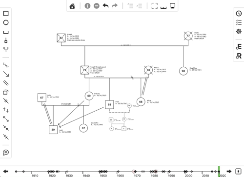

There are a lot of different things happening here.

First, views themselves do not show and hide items on the diagram, this is the function of event tags. Therefore, the event tags must be set on the view so that the view can use them to determine what should be shown and hidden when the view is activated and deactivated. In this example you only added a single tag to a single view, and even gave them both the same name of "Nuclear family." If this seemed redundant to you, then you were correct for this case. However, there may be cases where you may want to add multiple event tags to a single view. The app is designed for maximum flexibility to allow family researchers to use it in new and unexpected ways!

Second, while a tag was set on the view to show and hide people, various properties are stored on the item itself. These properties include position, color, and size, and deemphasis. When you activate and deactivate a view, each item in it reverts back to using the values it had the last time the view was activated. For example, if you activate your "Nuclear family," drag the people in the family around, then deactivate the view, you will notice that each person that you moved animates back into their default position. This is because changes to view properties, visible in the "Meta" tab in that item's property sheet, are stored in the active view. If there is no active view, they are stored in the item's default properties.

Third, callouts and drawings are stored in views. You can choose which views a particular callout and drawing resides in by inspecting them and checking those views in the list.

Click "Store Geometry" for the view to remember size and position settings for each item on the diagram. If you choose, you may later uncheck "Store Geometry" for that view which will revert the size and position settings to match the default view. *IMPORTANT: If you move items around while this view is active and you don't have this checkbox checked, then you will also be moving items around in your default view!*

You can set up as many views as you want. If you organize your views like powerpoint slides, then you can use the "Next View" and "Previous View" buttons in the top toolbar to move through your views like slides in a presentation without the views drawer open. This is a very effective way to present a family case without using a purely data-centric approach.

Here is a video explaining these concepts:

<iframe width="560" height="315" src="https://www.youtube.com/embed/2oEN2fv_6IE" title="YouTube video player" frameborder="0" allow="accelerometer; autoplay; clipboard-write; encrypted-media; gyroscope; picture-in-picture; web-share" allowfullscreen></iframe>

> ### Theoretical Dilemmas: Theory VS Presentation
> Early in the development of *Family Diagram*, a user asked if it would be possible to make people appear with a specific color. The user was interested in showing who was and who was not in the family business. While it is not hard to make a case for the importance of this kind of information, simply adding the ability to assign colors to people introduces an ambiguity in the meaning of the colors. What is the theoretical argument for designating one group within the broader system? Does an arbitrary sub-group designation possess a clearly-defined relationship with every other design decision of the app? What would someone unfamiliar with this person's use of a particular color make of the diagram? Does this detract from a well-principled standard for the family diagram concept? It is possible that the `genogram` became such a hodge-podge concept from appending various data without understanding what place the new data types had in the larger theoretical system. The genogram then lost its grounding in any one evolving theoretical system leaving its function to be decided by each person using it.
> 
> Diagram Views were designed to avoid these dilemmas. Views function to separate what is theoretically sound from the point that a presenter is trying to make at any point in time. The term *view* is accurate in the sense that it contains ideas that are superimposed on top of what is described in Bowen theory. This theoretical dilemma of deciding what new features are worthy of integration into the basic features of the app and which are merely presentation details is inherent in the development of *Family Diagram*. It is for this reason that it must be developed in contact with long-time students of Bowen theory who are able to critique and refine these design principles and their theoretical consistency.

## Research Server

(NOTE: The research server is currently disabled for public use.)

The app connects to a research server which contains a curated list of family diagrams contributed by fellow users. These diagrams are anonymized unless explicitly saved to use the real names, or to require a password to see the real names.

Perusing existing cases can provide a way to become familiar with the way families adapt in general. For example, it may be possible to bring a hypothesis to a series of family cases and see if any of the data from available cases contradict it.

### Using the Research Server

To use the research server, click the cloud icon at the bottom of the home/file browser screen. This will show a list of diagrams that you can open and view. You won't be able to change any of the data on the diagram or save it to a file, but you can view it all you like.

### Contributing to the Research Server

If you choose, you can contribute a family diagram to the research server. The research server can also be used to share diagrams for presentations. You are responsible for understanding any ethical obligations you may have to maintain confidentiality for the information contained in a contributed diagram.

To contribute a diagram to the research server, open the diagram settings by clicking the gear icon on the right side of the window. Then scroll down and click "Contribute to research". The diagram will be assigned an alias and registered with the server. It will not be available to other users of the app until it is approved by *Family Diagram* staff.

All names are replaced with aliases by default to protect the identities of the users. However, this process does not work perfectly when applied to event descriptions and note fields in all items. You should therefore take care when entering data. You can test this anonymization using the "Hide names" function in the diagram and scanning through events and notes fields for identifying information.

If you choose, you can click "Show real names" to show the real names of the people in the diagram. Additionally, you can click "Require password for real names" to prevent showing real names to people until they disable the "Hide Real Names" on their read-only copy and enter the password that is automatically generated next to the "Require password for real names" checkbox.

## References

Kerr, M., & Bowen, M. (1988). *Family evaluation: The role of the family as an emotional unit that governs individual behavior and development.* New York, NY: W. W. Norton.

Kerr, M. (2019). *Bowen theorys secrets: revealing the hidden life of families.* New York: W.W. Norton & Company.

Kitano, H. (2002, Mar 1). *Systems biology: A brief overview*. Science, 295(5560), 1662–1664. doi:10.1126/science.1069492

## Support

Please submit support requests here: [Contact & Support - Vedanā Media](https://vedanamedia.com/our-products/family-diagram/support/).

(C) 2023, Vedana Media